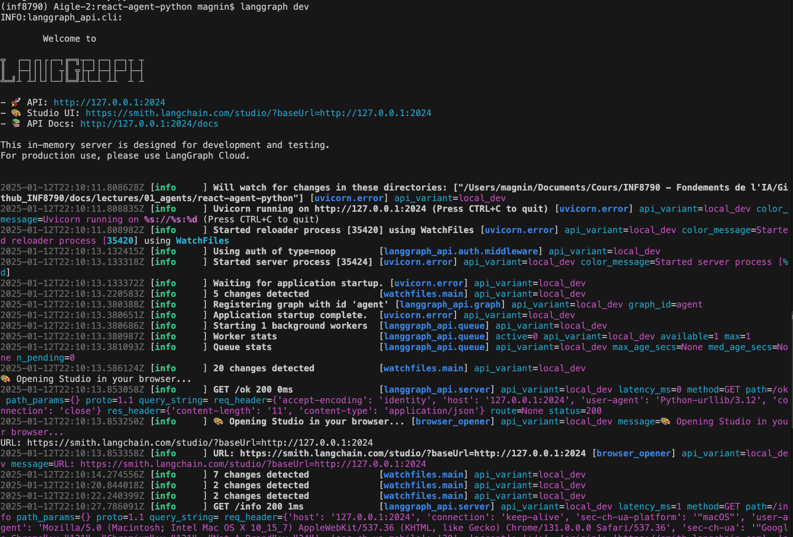
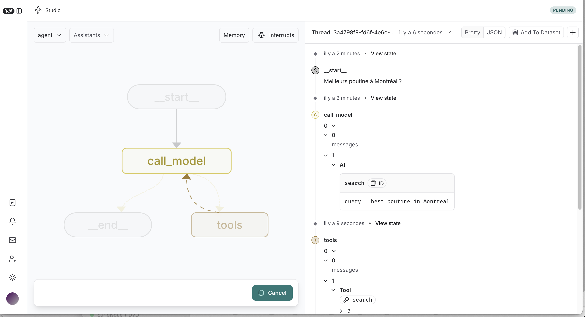
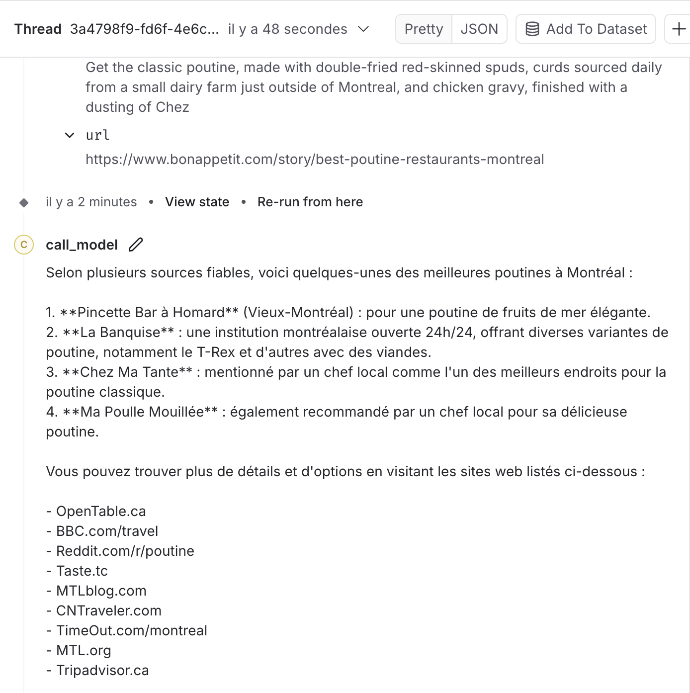

Voici un exemple concret avec du code fonctionnel pour illustrer l’utilisation des plateformes LangGraph, AutoGen, et CrewAI avec Ollama. Ce contenu est formaté en Markdown pour une intégration dans votre cours sur GitHub.

# Agents Intelligents et Systèmes Multi-Agents avec LangGraph, AutoGen, CrewAI, et Ollama

Ce document présente des exemples concrets d’utilisation des principales plateformes d’agents intelligents, avec du code fonctionnel.

[Conda](https://docs.conda.io/en/latest/) est utilisé ici pour organiser mes environnements de librairies Python.

Pour créer un environnement Conda basé sur Python 3.12.8 nommé `inf8790`, utilisez la commande suivante :

```bash
conda create --name inf8790 python=3.12.8
conda activate inf8790
pip install 'crewai[tools]'
```

---

🛠️ Exemple 1 : CrewAI pour la collaboration humain-agent

[Build your first CrewAI Agent](https://docs.crewai.com/quickstart)

```bash
$ crewai create crew latest-ai-development


Creating folder latest_ai_development...
Cache expired or not found. Fetching provider data from the web...
Downloading  [####################################]  291265/14498
Select a provider to set up:
1. [openai]
2. anthropic
3. gemini
4. groq
5. ollama
6. watson
7. bedrock
8. azure
9. cerebras
10. other
q. Quit
Select a model to use for Openai:
1. gpt-4
2. gpt-4o
3. gpt-4o-mini
4. [o1-mini]
5. o1-preview
q. Quit
Enter the number of your choice or 'q' to quit: 4
Enter your OPENAI API key (press Enter to skip): ....
API keys and model saved to .env file
Selected model: o1-mini
  - Created latest_ai_development/.gitignore
.../...
  - Created latest_ai_development/src/latest_ai_development/config/tasks.yaml
Crew latest-ai-development created successfully!

$ crewai install
$ crewai update

$ crewai run
```
```md
Running the Crew
   Built latest-ai-development @ file:///Users/magnin/Documents/Cours/INF8790%20-%20Fondements%20de%20l'IA/Github_INF8790/docs/lectures/01_agents/latest_ai_development
Uninstalled 1 package in 0.95ms
Installed 1 package in 2ms
# Agent: AI LLMs Senior Data Researcher
## Task: Conduct a thorough research about AI LLMs Make sure you find any interesting and relevant information given the current year is 2025.


# Agent: AI LLMs Senior Data Researcher
## Final Answer: 
1. **Multimodal Integration:** AI LLMs in 2025 seamlessly integrate text, image, audio, and video processing, enabling more comprehensive understanding and generation across multiple media formats.
2. **Real-Time Language Translation:** Advanced LLMs offer instantaneous and highly accurate translation services, bridging communication gaps across over 200 languages with contextual nuance.
3. **Personalized AI Assistants:** LLMs have evolved to provide deeply personalized assistance, adapting to individual user preferences, habits, and needs for enhanced productivity and user experience.
4. **Ethical and Bias Mitigation:** Significant advancements have been made in reducing biases within LLMs, with robust frameworks ensuring ethical AI deployment and promoting fairness in generated content.
5. **Enhanced Contextual Understanding:** 2025's LLMs possess superior contextual awareness, allowing for more accurate comprehension of complex queries and generation of relevant, context-specific responses.
6. **Efficient Computation and Sustainability:** Innovations in model optimization have led to more energy-efficient LLMs, reducing the carbon footprint associated with large-scale AI computations.
7. **Domain-Specific Expertise:** Specialized LLMs have been developed for industries such as healthcare, law, and finance, providing expert-level insights and support tailored to specific professional fields.
8. **Interactive Learning Capabilities:** Modern LLMs can engage in interactive learning, continuously updating their knowledge base through real-time interactions and user feedback without extensive retraining.
9. **Advanced Creative Applications:** LLMs are now widely used in creative industries for generating original content, including literature, music, and visual art, pushing the boundaries of human-AI collaboration.
10. **Regulatory Compliance and Governance:** Comprehensive regulatory frameworks have been established globally to oversee the development and deployment of LLMs, ensuring responsible AI usage and safeguarding user data privacy.


# Agent: AI LLMs Reporting Analyst
## Task: Review the context you got and expand each topic into a full section for a report. Make sure the report is detailed and contains any and all relevant information.


# Agent: AI LLMs Reporting Analyst
## Final Answer: 
# Report on AI LLMs Developments in 2025

## 1. Multimodal Integration
.../...
```

Et voici le rapport généré avec comme paramètre `"topic": "AI LLMs"` : [CrewAI Report](latest_ai_development/report.md)


## 🛠️ **Exemple 2 : Utilisation de LangGraph pour orchestrer plusieurs agents**

[Ollama](https://ollama.com) est une plateforme permettant de télécharger, exécuter et interagir localement avec des modèles de langage avancés, offrant une solution privée et flexible pour les applications basées sur l’intelligence artificielle (dixit ChatGPT).

[LangGraph](https://www.langchain.com/langgraph) est un _framework_ qui facilite la conception et l’orchestration d’agents intelligents en organisant leurs interactions et processus sous forme de graphes modulaires et optimisés (dixit ChatGPT).

[QuickStart: Launch Local LangGraph Server](https://langchain-ai.github.io/langgraph/tutorials/langgraph-platform/local-server/).

```bash
$ ollama serve
```

```bash
$ conda activate inf8790
$ pip install 'crewai[tools]' --upgrade "langgraph-cli[inmem]"
$ pip install langchain-ollama
$ langgraph new ./react-agent-python --template react-agent-python 

📥 Attempting to download repository as a ZIP archive...
URL: https://github.com/langchain-ai/react-agent/archive/refs/heads/main.zip
✅ Downloaded and extracted repository to /Users/magnin/Documents/Cours/INF8790 - Fondements de l'IA/Github_INF8790/docs/lectures/01_agents/react-agent-python
🎉 New project created at /Users/magnin/Documents/Cours/INF8790 - Fondements de l'IA/Github_INF8790/docs/lectures/01_agents/react-agent-python

$ cd react-agent-python
$ pip install -e .

$ langgraph dev
```



- 🚀 API: http://127.0.0.1:2024
- 🎨 Studio UI: https://smith.langchain.com/studio/?baseUrl=http://127.0.0.1:2024
- 📚 API Docs: http://127.0.0.1:2024/docs

Après avoir demandé les "Meilleures poutines à Montréal ?",



l'on obtient, suite à une recherche sur le Web, et à une synthèse des réponses obtenues :



--------------- 
Selon plusieurs sources fiables, voici quelques-unes des meilleures poutines à Montréal :

1. **Pincette Bar à Homard** (Vieux-Montréal) : pour une poutine de fruits de mer élégante.
2. **La Banquise** : une institution montréalaise ouverte 24h/24, offrant diverses variantes de poutine, notamment le T-Rex et d'autres avec des viandes.
3. **Chez Ma Tante** : mentionné par un chef local comme l'un des meilleurs endroits pour la poutine classique.
4. **Ma Poulle Mouillée** : également recommandé par un chef local pour sa délicieuse poutine.

Vous pouvez trouver plus de détails et d'options en visitant les sites web listés ci-dessous :

- OpenTable.ca
- BBC.com/travel
- Reddit.com/r/poutine
- Taste.tc
- MTLblog.com
- CNTraveler.com
- TimeOut.com/montreal
- MTL.org
- Tripadvisor.ca

Profitez de votre dégustation de poutine à Montréal !


:bulb: tapez `ctrl-C`pour quitter `ollama` et `langgraph dev`.

--------------- 
