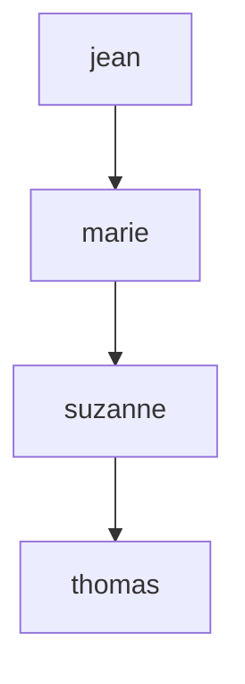
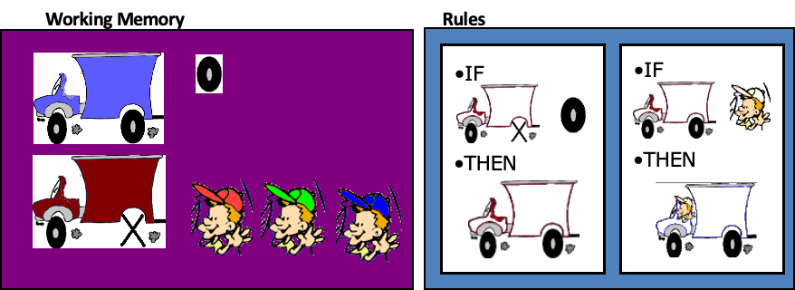

[Google Colab](https://colab.google)

-------

Code Prolog:

```
% Faits
plante(aloevera, ensoleille, sec, sableux).
plante(lavande, ensoleille, sec, argileux).
plante(bambou, ombre, humide, loameux).

% Règle
adaptable(X, Soleil, Eau, Sol) :- plante(X, Soleil, Eau, Sol).

% Requêtes
?- adaptable(X, ensoleille, sec, sableux).

```

Code pyDatalog

```shell
!pip install pyDatalog
```

```python
from pyDatalog import pyDatalog


pyDatalog.create_terms('plante, adaptable, X, Soleil, Eau, Sol')

+plante('aloevera', 'ensoleille', 'sec', 'sableux')
+plante('lavande', 'ensoleille', 'sec', 'argileux')
+plante('bambou', 'ombre', 'humide', 'loameux')

adaptable(X, Soleil, Eau, Sol) <= plante(X, Soleil, Eau, Sol)

print(adaptable(X, 'ensoleille', 'sec', 'sableux'))
```


# Exercice : Relations de descendance avec PyDatalog

## Objectif
Utiliser **PyDatalog** pour modéliser des relations familiales et répondre à des questions à l'aide de règles logiques.

---

## 1. Relations de descendance

Voici les relations familiales représentées sous forme de diagramme **Mermaid** :



---

## 2. Faits à modéliser

Les relations familiales à modéliser sont les suivantes :

1. `jean` est parent de `marie`.
2. `marie` est parent de `suzanne`.
3. `suzanne` est parent de `thomas`.

---

## 3. Questions à poser

Répondez aux questions suivantes en modélisant les faits et les règles dans PyDatalog :

1. **Qui est le grand-parent de `thomas` ?**
   - Attendu : `jean`.

2. **Qui est l’enfant de `jean` ?**
   - Attendu : `marie`.

3. **Qui est l’enfant de `marie` ?**
   - Attendu : `suzanne`.

4. **`jean` est-il grand-parent de `thomas` ?**
   - Attendu : `oui`.

4. **Quels sont les ancêtres de `thomas` ?**
   - Attendu : `suzanne`, `marie` & `jean`.
---

## 4. Instructions

1. **Étape 1 : Définir les faits**
   - Ajouter les relations parentales fournies ci-dessus dans PyDatalog.

2. **Étape 2 : Écrire les règles**
   - Une règle pour trouver les enfants à partir des parents.
   - Une règle pour trouver les grands-parents à partir des relations parentales.

3. **Étape 3 : Poser les requêtes**
   - Poser les questions ci-dessus et vérifier que vos résultats correspondent aux attentes.

[.](https://colab.research.google.com/drive/1vbrQ6af2iRHRM1WHV9sCxqv7cGnDw6AV?usp=sharing)


# Systèmes experts

Nous utiliserons ici [Experta](https://experta.readthedocs.io/en/latest/) comme moteur de règles.

Voici une reprise de l'exercice précédent sous forme de chaînage avant : [famille_experta.ipynb](https://colab.research.google.com/drive/1TvNjPMrF1NuC4KtrZshrgJNJ9EnncTMz?usp=sharing)

## Exercice 

Programmer avec Experta les règles et le problème suivants :
