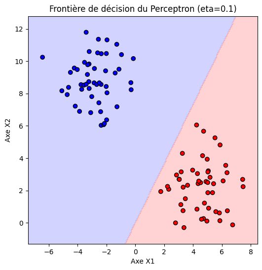
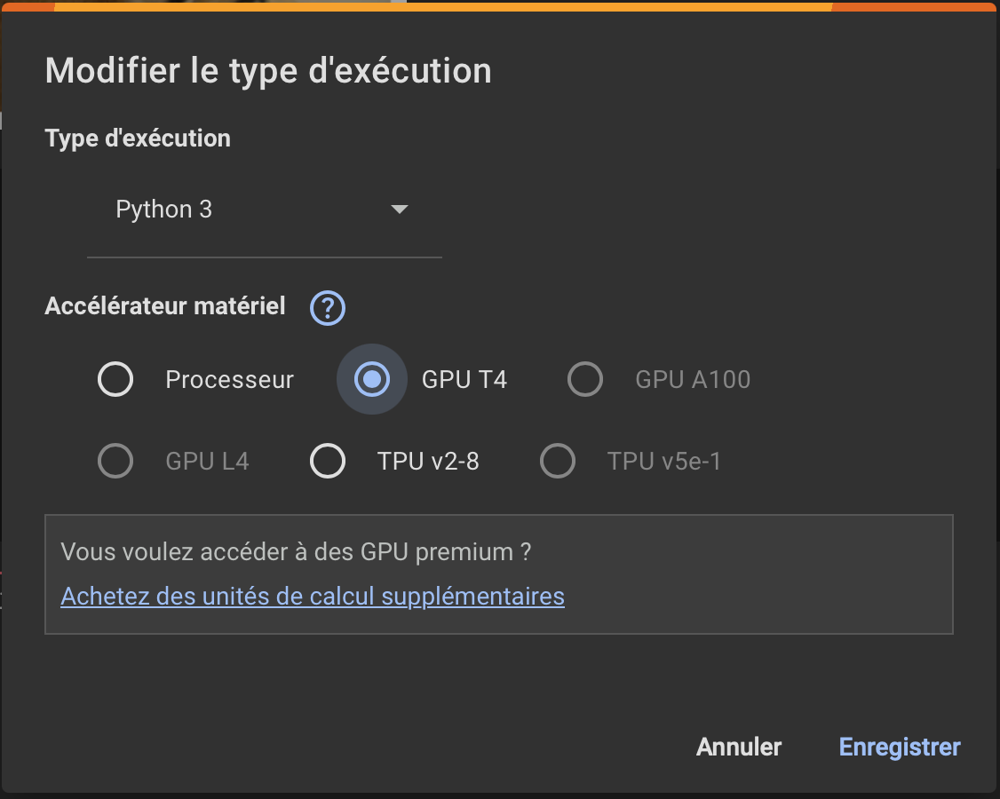
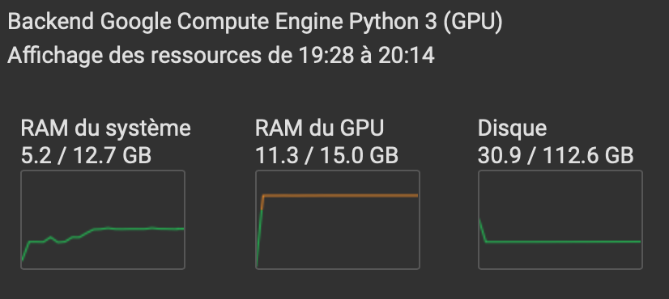

<script type="text/javascript" async
  src="https://polyfill.io/v3/polyfill.min.js?features=es6">
</script>
<script type="text/javascript" async>
  window.MathJax = {
    tex: {
      inlineMath: [['$', '$'], ['\\(', '\\)']],  // Enables single $ for inline math
      displayMath: [['$$', '$$'], ['\\[', '\\]']]
    },
    svg: {
      fontCache: 'global'
    }
  };
</script>
<script type="text/javascript" async
  src="https://cdnjs.cloudflare.com/ajax/libs/mathjax/3.2.2/es5/tex-mml-chtml.js">
</script>


## INF8790 - Fondements de l'IA
# 07 - Réseaux de neurones et apprentissage profond

:bulb: Suggestion : les exercices suivants peuvent être réalisés sur [Google Colab](https://colab.google).

## A - Introduction au Perceptron

Dans cet exercice, nous allons créer un **Perceptron** simple pour séparer linéairement deux classes de points en 2 dimensions.

## Objectifs
1. Générer un jeu de données 2D artificiel.
2. Implémenter le Perceptron (sans utiliser de bibliothèques de ML).
3. Entraîner le Perceptron via une boucle d'apprentissage.
4. Visualiser la frontière de décision et vérifier la convergence.

## Étapes à réaliser

1. **Import des bibliothèques**  
   - `numpy` pour la manipulation de tableaux.  
   - `matplotlib` pour les visualisations.  
   - `sklearn.datasets` (optionnel) si vous voulez générer un jeu de données (ex. `make_blobs`).
   - `%matplotlib inline` pour un affichage inline dans un notebook

2. **Génération du dataset**  
   - Créez ou utilisez une fonction pour générer des points 2D appartenant à deux classes séparables linéairement.  
   - Visualisez ces points pour vérifier la séparation.

    ```python
    X, y = make_blobs(n_samples=100, centers=2, n_features=2, 
                      random_state=42, cluster_std=1.5)

    # X.shape = (100, 2), y.shape = (100,)

    # Visualisation des points
    plt.figure(figsize=(6, 6))
    plt.scatter(X[:, 0], X[:, 1], c=y, cmap='bwr')
    plt.title("Dataset : deux classes linéairement séparables (espérons !)")
    plt.xlabel("Axe X1")
    plt.ylabel("Axe X2")
    plt.show()
    ```

3. **Implémentation du Perceptron**  
   - Définissez les paramètres : $w$ (poids), $b$ (biais).  
   - Définissez la fonction d'activation (seuil) au sein de la fonction `def predict(x, w, b):`  
     $$
     \hat{y} = 
     \begin{cases} 
       1 & \text{si } (w \cdot x + b) \geq 0\\
       0 & \text{sinon}
     \end{cases}
     $$

4. **Boucle d’entraînement**  
   - Pour chaque époque :  
     1. Parcourez tous les échantillons du jeu de données.  
     2. Calculez la prédiction, mettez à jour $w$ et $b$ si besoin (**règle d’apprentissage**) :  

      $$
      w \leftarrow w + \eta \cdot (y - \hat{y}) \cdot x
      $$

      $$
      b \leftarrow b + \eta \cdot (y - \hat{y})
      $$

        où :
        - $ w $ est le vecteur de poids,
        - $ b $ est le biais,
        - $ \eta $ est le taux d’apprentissage,
        - $ y $ est la vraie étiquette,
        - $ \hat{y} $ est la prédiction du Perceptron,
        - $ x $ est l’entrée.

      ```python
      def perceptron_train(X, y, eta=0.1, n_epochs=10):
          # X : matrice des features (N échantillons, d dimensions)
          # y : vecteur d'étiquettes (0 ou 1)
          # eta : taux d'apprentissage
          # n_epochs : nombre d'itérations sur l'ensemble des données

          .../...
      ```

   - Stockez l’évolution du **taux d’erreur** (ou du nombre de points mal classés) pour observer la convergence.

   - Lancez l'entraînement du Perceptron

      ```python
      eta = 0.1       # Taux d'apprentissage
      n_epochs = 15   # Nombre d'époques

      w, b, errors = perceptron_train(X, y, eta=eta, n_epochs=n_epochs)

      # Affichons l'évolution du nombre d'erreurs
      plt.figure(figsize=(6, 4))
      plt.plot(range(1, n_epochs+1), errors, marker='o')
      plt.title("Evolution du nombre d'erreurs à chaque époque")
      plt.xlabel("Epoque")
      plt.ylabel("Nombre d'erreurs")
      plt.show()
      ```

5. **Visualisation de la frontière de décision**  
   - Sur un graphique 2D, affichez :  
     - Les points du dataset.  
     - La frontière de décision (ligne où $w \cdot x + b = 0$).  
   - Vérifiez si votre Perceptron classe correctement la quasi-totalité des points (s’il y a convergence).

    ```python
    x_min, x_max = X[:, 0].min() - 1, X[:, 0].max() + 1
    y_min, y_max = X[:, 1].min() - 1, X[:, 1].max() + 1

    xx, yy = np.meshgrid(np.linspace(x_min, x_max, 200),
                         np.linspace(y_min, y_max, 200))

    # Pour chaque point de la grille, prédisons la classe
    Z = np.zeros(xx.shape)
    for i in range(xx.shape[0]):
        for j in range(xx.shape[1]):
            Z[i, j] = predict([xx[i, j], yy[i, j]], w, b)

    # Tracé des régions
    plt.figure(figsize=(6, 6))
    plt.contourf(xx, yy, Z, alpha=0.2, cmap='bwr')

    # Tracé des points d'entraînement
    plt.scatter(X[:, 0], X[:, 1], c=y, cmap='bwr', edgecolors='k')
    plt.title(f"Frontière de décision du Perceptron (eta={eta})")
    plt.xlabel("Axe X1")
    plt.ylabel("Axe X2")
    plt.show()
    ```

    

6. **Aller plus loin (options)**  
   - Visualiser l’**évolution** de la frontière de décision après chaque **époque** (animation ou plots successifs).  
   - Tester d’autres types de distributions de données (plus ou moins séparables).  
   - Varier le **taux d’apprentissage** ($\eta$) et observer l’impact sur la convergence.

## Conseils
- Commencez par initialiser $w$ et $b$ à de petites valeurs aléatoires (0.0 ou un petit nombre).
- Faites attention à la **taille** de vos vecteurs et la cohérence dans les multiplications.
- Amusez-vous à modifier le **taux d’apprentissage** et le **nombre d’époques** pour voir comment ça influe sur le résultat.

Bon courage !

---
<details>
  <summary>Solution complète</summary>
    La solution complète sera révélée samedi soir prochain.
  <a href="https://colab.research.google.com/drive/1_r0eW94syX7kiqVktNiN67NKFs50GMXv?usp=sharing">inf8790_perceptron.ipynb</a>
</details>

## B - Chien ou Chat ? Les réseaux neuronaux sont là pour vous répondre !



Le but de l'exercice est d'entraîner un réseau de neurones à reconnaître les chats des chiens...

Pour cela, nous allons nous baser sur les images fournies par Microsoft : [Kaggle Cats and Dogs Dataset](https://www.microsoft.com/en-us/download/details.aspx?id=54765).

L'exercice peut se faire en suivant le tutoriel suivant : [Image classification from scratch](https://keras.io/examples/vision/image_classification_from_scratch/).

:warning: Vous devez utiliser des GPUs (en lieu et place de CPUs).

:bulb: Cet exercice fonctionne en utilisant JAX en backend (voir [Getting started with Keras](https://keras.io/getting_started/))

:bulb: Implémentez l'option 1 (afin de bénéficier de l'accélération GPU) pour ce qui concerne la _data_augmentation_.

Comme vous pouvez le voir ci dessous, la mémoire du GPU est utilisée presque à son maximum :


:bulb: Pour éviter un temps d'apprentissage trop long (ce qui peut amener à perdre la session du _notebook_), réduire le nombre d'_epochs_ (choisir p. ex. 10).


---

<details>
  <summary>Solution complète</summary>
    La solution complète sera révélée samedi soir prochain.
<div style="display: none;">
  <a href="https://colab.research.google.com/drive/1qcoX7BjD_YAFMs84DNhRybohudy1Y_lz?usp=sharing">inf8790_keyras.ipynb</a>
</div>
</details>

## B - 

--------------- 


### Copyright (c)Laurent Magnin / UQÀM 2025