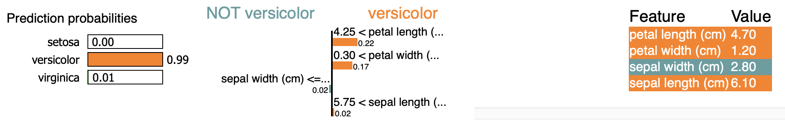
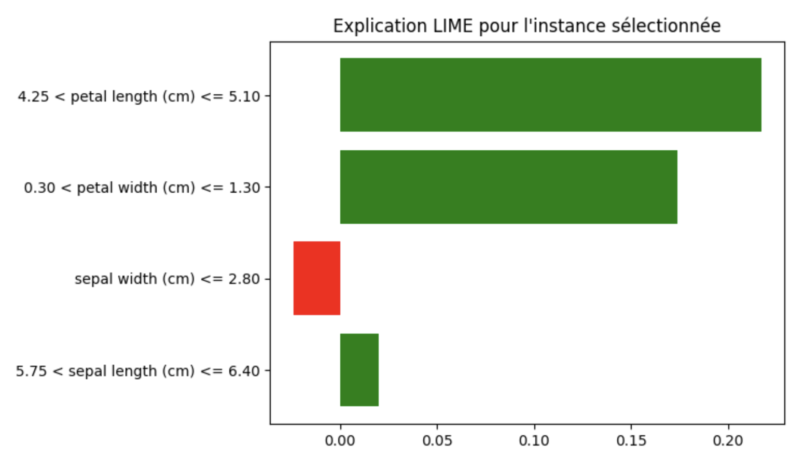
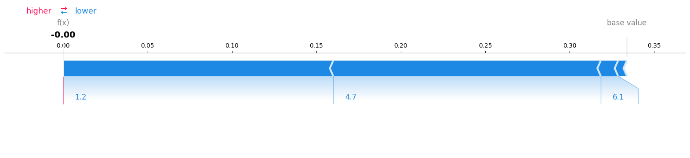

<script type="text/javascript" async
  src="https://polyfill.io/v3/polyfill.min.js?features=es6">
</script>
<script type="text/javascript" async>
  window.MathJax = {
    tex: {
      inlineMath: [['$', '$'], ['\\(', '\\)']],  // Enables single $ for inline math
      displayMath: [['$$', '$$'], ['\\[', '\\]']]
    },
    svg: {
      fontCache: 'global'
    }
  };
</script>
<script type="text/javascript" async
  src="https://cdnjs.cloudflare.com/ajax/libs/mathjax/3.2.2/es5/tex-mml-chtml.js">
</script>


## INF8790 - Fondements de l'IA
# 101 - IA opérationnelle

:bulb: Suggestion : les exercices suivants peuvent être réalisés sur [Google Colab](https://colab.google).

## A - Comprendre le jeu de données Iris avec LIME

### Objectif :
Utiliser la librairie [LIME](https://github.com/marcotcr/lime) pour interpréter les prédictions d’un modèle de classification (RandomForest) entraîné sur le [jeu de données Iris](https://fr.wikipedia.org/wiki/Iris_de_Fisher).

---

### Étape 1 : Préparation du Notebook et installation des dépendances

#### Instructions :
1.	Ouvrez un nouveau notebook sur [Google Colab](https://colab.google).
2.	Dans la première cellule, installez la librairie LIME.

```Python
!pip install lime --quiet
````
#### Explications :
Cette commande installe la librairie [LIME](https://pypi.org/project/lime/) qui sera utilisée pour générer des explications locales du modèle. Le paramètre `--quiet` permet de réduire la verbosité de l’installation.

---
### Étape 2 : Importer les bibliothèques et charger le jeu de données

#### Instructions :
1.	Importez les bibliothèques nécessaires : _NumPy_, _Pandas_, _Matplotlib_, ainsi que les modules de _scikit-learn_ pour charger les données et entraîner le modèle.
2.	Chargez le jeu de données Iris à l’aide de `load_iris` et séparez les données en variables d’entrée et cibles.
3.	Divisez le jeu de données en ensembles d’entraînement et de test.

```Python
import numpy as np
import pandas as pd
import matplotlib.pyplot as plt

from sklearn.datasets import load_iris
from sklearn.model_selection import train_test_split
from sklearn.ensemble import RandomForestClassifier

from lime.lime_tabular import LimeTabularExplainer

# Chargement du jeu de données Iris
iris = load_iris()
X = iris.data
y = iris.target
feature_names = iris.feature_names
class_names = iris.target_names

# Division en ensembles d'entraînement et de test
X_train, X_test, y_train, y_test = train_test_split(X, y, random_state=42, test_size=0.2)
```

#### Explications :
Cette cellule prépare l’environnement en important toutes les bibliothèques requises. Le jeu de données Iris, très connu en machine learning, est utilisé ici pour sa simplicité. La division en ensembles d’entraînement et de test permet d’entraîner le modèle sur une partie des données et de tester ses performances sur l’autre.

---
### Entraîner un modèle de classification

#### Instructions :
1.	Utilisez un modèle de RandomForest pour effectuer la classification sur le jeu de données Iris.
2.	Entraînez le modèle sur l’ensemble d’entraînement et effectuez une première prédiction sur l’ensemble de test.

```Python
# Entraînement d'un modèle RandomForest
clf = RandomForestClassifier(n_estimators=100, random_state=42)
clf.fit(X_train, y_train)

# Prédiction sur l'ensemble de test
predictions = clf.predict(X_test)
print("Prédictions sur le test :", predictions)
````

#### Explications :
Le modèle RandomForest est choisi pour sa robustesse et sa capacité à gérer des problèmes de classification. Les prédictions affichées permettent de vérifier que le modèle fonctionne correctement avant de procéder à l’explication.

---
### Créer l’_explainer_ LIME

#### Instructions :
1.	Initialisez un objet LimeTabularExplainer en utilisant l’ensemble d’entraînement et en passant les noms des caractéristiques et des classes.
2.	Précisez que le mode est ‘classification’.

```Python
explainer = LimeTabularExplainer(
    training_data = X_train,
    feature_names = feature_names,
    class_names = class_names,
    mode = 'classification'
)
```

#### Explications :
L’objet LimeTabularExplainer est configuré pour travailler avec des données tabulaires. Il se sert des données d’entraînement pour générer des explications locales sur les prédictions du modèle.

---
### Expliquer une prédiction avec LIME et visualiser l’explication

#### Instructions :
1.	Sélectionnez une instance dans l’ensemble de test que vous souhaitez expliquer.
2.	Utilisez la méthode explain_instance de l’explainer pour obtenir une explication de la prédiction sur cette instance.
3.	Affichez l’explication dans le notebook sous forme de tableau et de graphique.

```Python
# Choix d'une instance à expliquer (par exemple, l'élément à l'indice 1)
idx = 0
instance = X_test[idx]

# Générer l'explication de l'instance sélectionnée
exp = explainer.explain_instance(instance, clf.predict_proba, num_features=4)

# Afficher l'explication dans le notebook
exp.show_in_notebook(show_table=True)
```



Pour visualiser graphiquement :
```Python
fig = exp.as_pyplot_figure()
plt.title("Explication LIME pour l'instance sélectionnée")
plt.show()
```



#### Explications :
- La fonction `explain_instance` génère une explication en évaluant l’importance locale de chaque caractéristique sur la prédiction.
- Le paramètre `num_features=4` indique que seules les 4 caractéristiques les plus influentes seront affichées.
- La méthode `show_in_notebook` permet de visualiser l’explication directement dans le notebook, et `as_pyplot_figure` offre une représentation graphique pour mieux comprendre l’impact de chaque caractéristique.

---
### Réflexion et ajustements

#### Instructions complémentaires :
-	Expérimentez avec différents paramètres :
Essayez de modifier `num_features` ou sélectionnez d’autres indices d’instances pour observer comment l’explication change.
-	Analysez les résultats :
Discutez de l’importance relative de chaque caractéristique et de la manière dont elle influence la prédiction du modèle. Que vous apprend l’explication sur le comportement de votre modèle ?
-	Documentez vos observations :
Prenez des notes sur la compréhension des explications fournies par LIME et comment cela pourrait influencer des décisions de développement ou d’optimisation du modèle.

---

<details>
  <summary>Solution complète</summary>
  <a href="https://colab.research.google.com/drive/1sd_uxY3KJmjrFjRG4zNyzcPpOeWpWBlZ?usp=sharing">inf8790_lime.ipynb</a>
</details>

## B - Comprendre le jeu de données Iris avec SHAP

En reprenant le modèle `clf = RandomForestClassifier(n_estimators=100, random_state=42)` appliqué aux données d'iris, utiliser la librairie [Shap](https://shap.readthedocs.io/en/latest/example_notebooks/tabular_examples/model_agnostic/Iris%20classification%20with%20scikit-learn.html) pour obtenir une explication des prédictions. 

:bulb: Lorsqu'exécuté dans Google Colab, voici comment éviter l'erreur `Visualization omitted, Javascript library not loaded!` : [You need to import and provide matplotlib in the function call](https://github.com/shap/shap/issues/279#issuecomment-1860945852). :warning: Cette astuce ne fonctionne qu'avec une prédiction unique...



---

<details>
  <summary>Solution complète</summary>
  <ul>
    <li><a href="https://colab.research.google.com/drive/1GoW34vACUKA0vCAzBjPsF2sSxwbZWWp-?usp=sharing">inf8790_shap.ipynb</a></li>
    <li><a href="https://colab.research.google.com/github/reheinrich/shap-tutorials/blob/main/shap-basic-guide.ipynb">shap-basic-guide.ipynb</a></li>
  </ul>
</details>

--------------- 


### Copyright (c)Laurent Magnin / UQÀM 2025